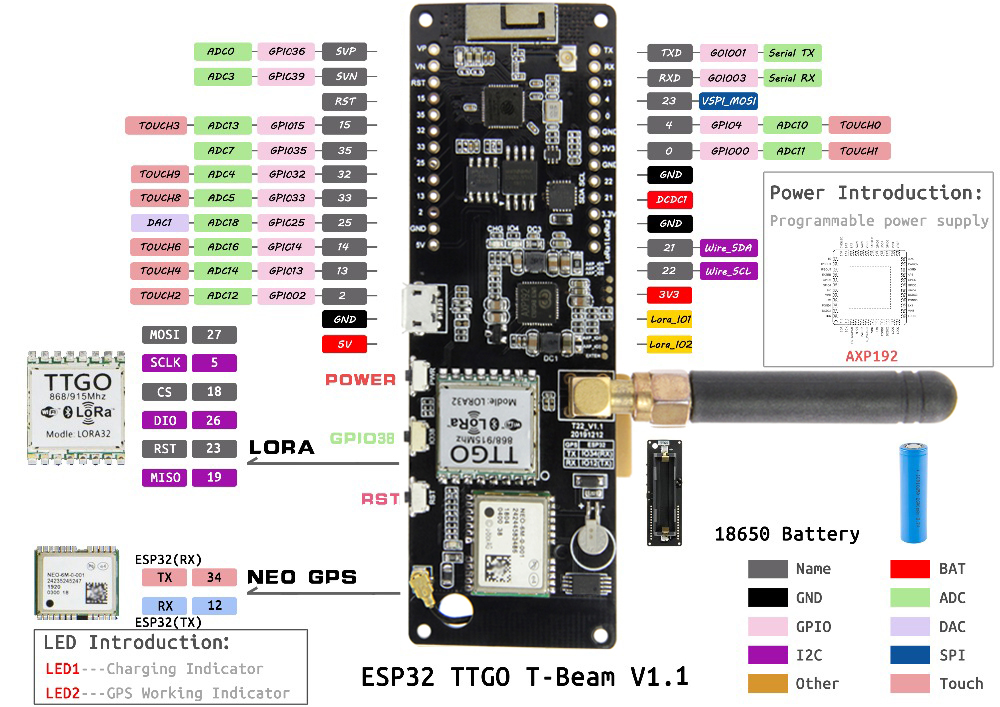
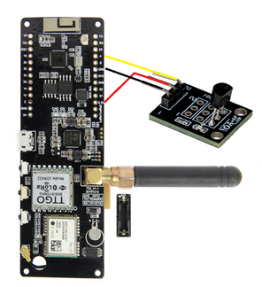

# Cross-Network-LoRaMesher

This project aims to explore cross-network LoRaMesher applications.

## Installation

Install docker:

```bash
sudo apt update

sudo apt install -y ca-certificates curl gnupg lsb-release

sudo mkdir -p /etc/apt/keyrings
curl -fsSL https://download.docker.com/linux/ubuntu/gpg | sudo gpg --dearmor -o /etc/apt/keyrings/docker.gpg

sudo echo  "deb [arch=$(dpkg --print-architecture) signed-by=/etc/apt/keyrings/docker.gpg] https://download.docker.com/linux/ubuntu  $(lsb_release -cs) stable" | sudo tee /etc/apt/sources.list.d/docker.list > /dev/null
sudo apt update

sudo apt install -y docker-ce docker-ce-cli containerd.io docker-compose-plugin

sudo groupadd docker

sudo usermod -aG docker $USER
```

Install docker compose:

```bash
sudo curl -L "https://github.com/docker/compose/releases/latest/download/docker-compose-$(uname -s)-$(uname -m)" -o /usr/local/bin/docker-compose
sudo chmod +x /usr/local/bin/docker-compose
```

## Connection


Note that the boards are connected to sensors. If they are not connected, use a cable for each sensor pin and connect them to the corresponding pins on the boards (3.3v, gnd, and data). Currently, pin 4 has been used, so with the current program, it is sufficient to connect the 3 pins, keeping in mind that the data pin is pin 4. 
If you want to change the pin, you also need to change the value of sensor_data_pin defined in the monitoring.cpp file. 

The following images show a guide for making the connection.





In addition, depending on the board you are uploading the program, you must change some code (all in monitoring.cpp file):

First, comment all the functions with the following header: "float Monitoring::getSensorValue()". 1 line above the header you should find a comment that shows what function works for each case.

If the board has no sensors connected ("NO SENSOR" uncommented).

If the board has a digital temperature sensor connected ("DIGITAL TEMPERATURE" uncommented).

If the board has a (digital) button sensor connected ("Button" uncommented).

## Uploading the program to the board


Once you connect the board to the PC via USB, you must change the permissions of the device. You can give some other permissions, but is preferible to give it all to not have problems uploading.

```bash
sudo chmod 777 /dev/ttyACM0
```

Change /dev/ttyACM0 to your device name. To know the device you can use:

```bash
pio device list
```

when you had installed the platformio core. Now, you must upload using:

```bash
pio run -e ttgo-t-beam -t upload --upload-port /dev/ttyACM0
```
Once again, change /dev/ttyACM0 to your device you are using, and you will have the program uploaded to the board.


## Usage


To start the Monitoring Services, in the "MonitoringService" folder execute:

```bash
docker-compose up -d
```

You can also execute the script, but it is recommended using the docker-compose.

```bash
./startmonitoring.sh
```

Credentials for your local emqx broker are user: "admin" password: "public"
Credentials for your local grafana server are user: "admin" password: "admin"

EMQX broker: [http://localhost:18083](http://localhost:18083)

InfluxDB: [http://localhost:8086](http://localhost:8086)

Grafana: [http://localhost:3000](http://localhost:3000)

Query web app: [http://localhost:3006](http://localhost:3006)
